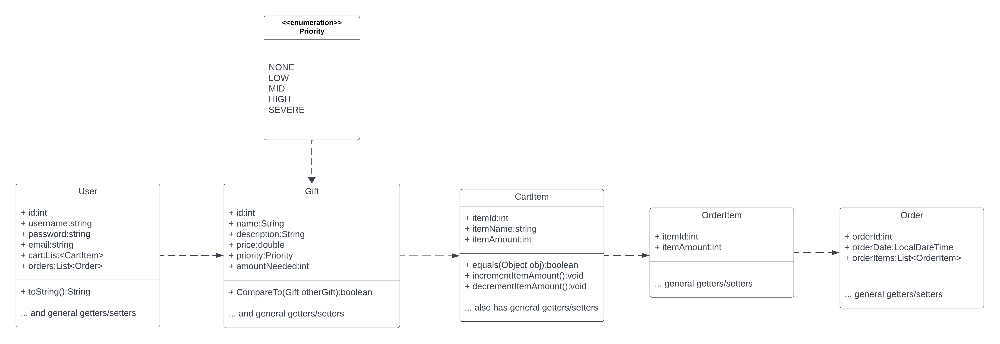
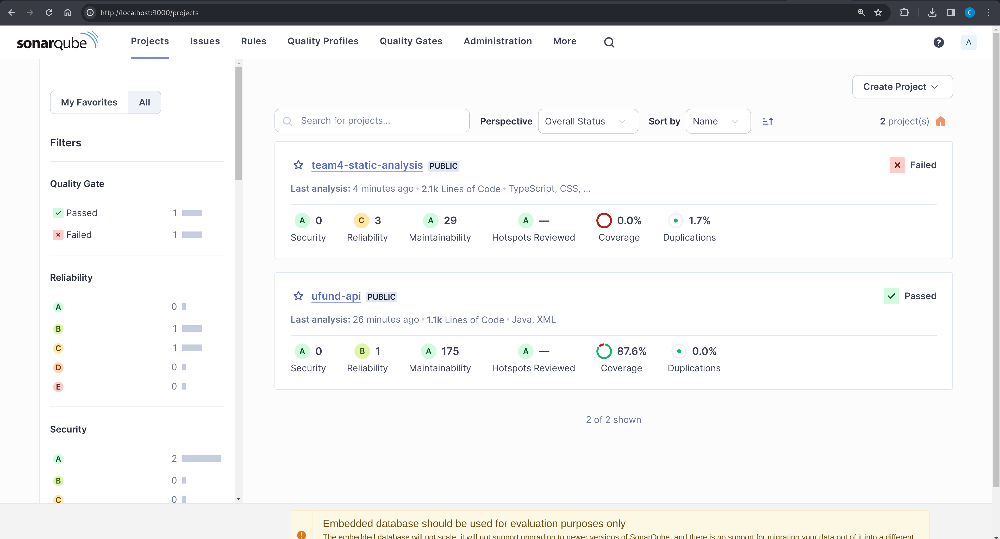

# PROJECT Design Documentation

## Team Information
* Team name: 71g3r (Tiger)
* Team members
  * Christopher Brooks
  * Howard Kong
  * Austin Kunkel
  * Ethan Ricker

## Executive Summary

Our project is U-Fund School Supplies. Many students are in need of school supplies. With this website, you can pick and choose school supplies to donate to schools. Examples include Backpacks, Art Supplies, Lunches, and other common supplies. Each need has an amount that is requested and users can fund to meet that goal.

### Purpose

With our website, you can pick any supply and fund them for students. It will show you what supplies are needed, the cost, and a description of each one. With our website, you can help students who may not be able to afford these supplies. 

The User Group is the people who we be donating to the school (parents, previous students, and other people in the community). The User Goal is to fund school supplies.

### Glossary and Acronyms

| Term | Definition |
|------|------------|
| Gift | the item or supply to the funded |
| Helpers | the users who have an account and can purchase items for students |
| Admin | a person who can edit the items in the cupboard |
| Cupboard | where all the items to be funded are stored. Everything in the cupboard is able to be funded by Helpers |

## Requirements

This section describes the features of the application.

### Definition of MVP

Users should be able to login and logout, view all of the needs, search for needs, add needs to cart, and logout and have the items in the cart save. Admins should also be able to login and add/remove or edit items.

### MVP Features

Users can log in with their own account.
Users can browse a list of needs (school supplies).
Users can pick a need to support and pick the amount to support.
Users can add items to their cart and checkout
Users have persistence, they can log out and cart will save 
Admins can edit the needs in the cupboard, edit amount, add/remove items, etc.

### Enhancements

Feature Enhancement 1: Sort by priority.

This allows a user to sort the items by what is most needed to be funded. Each item has a priority given to it, from Low to SEVERE. By using a drop down menu on the website, users can sort the items by Ascending or Descending. This makes it so the most needed (or least needed) items will appear first on the list. Now the user knows what items they should be donating to and which items are not in need currently.

Feature Enhancement 2: Total amount donated.

On the user page, this feature shows the total amount of money that the user has donated. For example, if the user makes multiple orders, the total amount of all their orders will be shown. This tells the user how much they have contributed total.

## Application Domain

This section describes the application domain.

The domain for Ufund School supplies includes the users and the cupboard. Users include both the admin and the helper. Both of these have different tasks. The admin can add, edit, or remove needs, while the helper can add/remove needs to the cart and purchase needs. The cupboard contains the list of needs. Needs themselves have a cost, description, and quantity needed. All the needs in the cupboard are presented to the user. 

## Architecture and Design

This section describes the application architecture.

### Summary

The following Tiers/Layers model shows a high-level view of the webapp's architecture. 

The web application, is built using the Model–View–ViewModel (MVVM) architecture pattern. 

The Model stores the application data objects including any functionality to provide persistence. 

The View is the client-side SPA built with Angular utilizing HTML, CSS and TypeScript. The ViewModel provides RESTful APIs to the client (View) as well as any logic required to manipulate the data objects from the Model.

Both the ViewModel and Model are built using Java and Spring Framework. Details of the components within these tiers are supplied below.

### Overview of User Interface

This section describes the web interface flow; this is how the user views and interacts with the web application.

When you first enter the application, you are brought to the home page. This page shows all the needs that are available to fund. It gives you the option to add to cart, but since you are not logged in yet, clicking on add to cart will bring you to the login page. Here you can login or create an account. Logging in will bring you back into the home page where you can add items to your cart. You can also click on each item to view more details about it, such as cost, a description, etc.. If you are a admin you are brought to a separate page.

### View Tier
> _**[Sprint 4]** Provide a summary of the View Tier UI of your architecture.
> Describe the types of components in the tier and describe their
> responsibilities.  This should be a narrative description, i.e. it has
> a flow or "story line" that the reader can follow._

## Summary of View Tier Components
When you first log in, you will see the need page. This has the gifts, gifts-search, and navbar componets. This display the gifts and allowd you to search for gifts (gifts-search) and navigate the site (navbar). Clicking on a gift will bring you to gift detail, which brings you to a separate page displaying greater information about the gift (description, price, etc.). 

Clicking on add to cart will bring you to the login page (if not logged in) with the login component. If you do not have an account, you can also make one and it will bring you to the signup component.

Finally, if you are logged in, you can click on the user button to be brought to the account component, which displays details about your account (name, previous orders, total donated, etc.). You can click the cart button to be brought to the cart component, which displays items in your cart. Then you can click order which will bring you to the order compoent which will create and make an order.

> _**[Sprint 4]** You must  provide at least **2 sequence diagrams** as is relevant to a particular aspects 
> of the design that you are describing.  (**For example**, in a shopping experience application you might create a 
> sequence diagram of a customer searching for an item and adding to their cart.)
> As these can span multiple tiers, be sure to include an relevant HTTP requests from the client-side to the server-side 
> to help illustrate the end-to-end flow._
>
**2 sequence diagrams**

# User Search For Item

> _**[Sprint 4]** To adequately show your system, you will need to present the **class diagrams** where relevant in your design. Some additional tips:_
 >* _Class diagrams only apply to the **ViewModel** and **Model** Tier_
>* _A single class diagram of the entire system will not be effective. You may start with one, but will be need to break it down into smaller sections to account for requirements of each of the Tier static models below._
 >* _Correct labeling of relationships with proper notation for the relationship type, multiplicities, and navigation information will be important._
 >* _Include other details such as attributes and method signatures that you think are needed to support the level of detail in your discussion._

### ViewModel Tier
**GiftController:** Controls and implements the CRUD operations for the Gifts (Needs). Has update, delete, add, get all, retrieve, etc.
**UserController:** Controls and implements the CRUD operations for the Users. Same as gifts, can add users, delete, edit, etc.

> _**[Sprint 4]** Provide a summary of this tier of your architecture. This
> section will follow the same instructions that are given for the View
> Tier above._

> _At appropriate places as part of this narrative provide **one** or more updated and **properly labeled**
> static models (UML class diagrams) with some details such as critical attributes and methods._
> 

### Model Tier

This tier contains the classes that represent different parts of our application. This is the tier where the logic for these classes are located. The User will interact with the View (or the website UI) which will user the model for its logic, manipulation, and more. The following bullets describe some of the classes in the model tier.

**Gift:** Represents the gift (Need). It has a name, description, price, and the amount needed for funding.

**User:** A U-Fund user. Has a username, password, email, and their cart. Their data will save in the cart.

**Model Tier classes added during Sprint 2/3:** 

**Order:** Represents an order. This is a list of OrderItems that a user ordered. It has an ID, date of checkout, and the list of items. These are made per user.

**OrderItem:** This represents and item ordered by user. A list of these are in Order.

**Priority:** This represents a prority of an Gift, from LOW to SEVERE. This represents how much the item is wanted. Helpers should focus on the higher level priority items. For a feature enhancement, we added an option to sort by prority, so the Helper can easily see where to direct their attention to.

The following UML diagram describes the Model Tier of our application.

## OO Design Principles

**4 key OO Principles**

Low Coupling: Each class should be as independent as possible. For example, the Gift and User CRUD operations are implemented in separate files to avoid conflict. Although the code actions are mostly the same, it would be best to keep them separated in case we need unique code for one.

Controller: We followed the Controller Model View model for creating our software. For example, GiftController and UserController are separate, while Gift and Controller classes are in their own files in the model folder. We also have a separate folder for persistence, which deals with persistence.

Law of Demeter: We separated the Gift and User classes, they cannot access each others data.

Dependency Inversion/Injection: We abstracted certain parts of our code. A big example of this is in the DAO files. For example, we have the code that adds a new Gift to the cupboard. The code that actually writes to the JSON itself (And follows the JSON format) is abstracted away for us already. All we have to do it call the DAO function. This is better because we now only have to worry about just calling the add function, and have to know nothing about the implementation of actually writing the JSON.

Open/Closed: We designed our classes to be able to extended easily. We could add more code/functionality to it if we wanted to. But we also kept it closed/avoided modification. This way, we can extend our classes if needed, but not change them completely.

We also worked on separate files as much as possible. This helps us avoid merge conflicts. This made the code easier for the team to work on, since we didn't have to constantly worry about overwriting each others code.

## Static Code Analysis/Future Design Improvements

The areas that have been flagged the most in our SonarQube analysis is Reliability and Coverage. First, Coverage relates to how much of the code is covered by tests. It marked us at 87.6% code coverage. That is a decent amount covered by tests, but it would be best if we could get that number a bit higher. We have 0% coverage for our UI portion, but that makes sense because we only wrote tests for the backend. 

We also got decent scores in the maintainability section, which is good because we want to make sure our code is easy to maintain and develop for. Also, Duplication scores are low or 0.

**Future Refactoring and Design Improvements**

If we had additional time on the project, we would work on improving the reliability of our project, as SonarQube gave us the lowest score for that section. We would improve this by making extremely sure there are no bugs and issues in the project.

## Testing

### Acceptance Testing

**Sprint 2, 3 and 4 User stories added during this sprint:**
For more details, such as dates and comments, please see the Acceptance Testing document located in the /etc directory of this repo.

**Login:** All passed

**Logout**: All passed

**Home page (where needs are listed):** All passed

**Search**: All passed

**Admin page**: All passed. As of 3-21-24 this page is done.

**Cart:** All passed. Fixed error with removing items on 3-21-24.

**Details page:** All passed.

**Sort by priority:** All passed. Implemented 4-7-24.

**Orders**: All passed. Can order and checkout items. 4-22-24

**Total Contribution:** All passed 4-22-24.

### Unit Testing and Code Coverage

Our code coverage targeted mainly the Model and Persistence tiers of our code base. We spend most time developing the unit tests for the persistence tier, as those were the hardest to develop tests for. Our strategy was to first implement the test (or a stub of the test, which had the expected value and failed at first), then to develop the feature in the code. As we worked on the feature, we slowly got closer to matching the expected result of the test. we continued to work on the feature until the test passed. We basically followed the Test Driven Development (TDD) model.

**Sprint 2, 3 and 4 Code Coverage Report**

We were able to achieve 90% test coverage for sprints 2, 3 and 4. 

## Ongoing Rationale

2024-2-09 Sprint 1: Team decided School Supplies U-Fund idea and created sprint 1 plan.

2024-2-20 Sprint 1: Team decided on using Gift for the needs.

2024-3-20 Sprint 2: Team decided to store password as a SHA512 hash instead of plaintext for better security.

2024-4-22 Sprint 4: Team made it so website will not let you create a new user if one with the same name already exists.

2024-4-22 Sprint 4: Team made the user page shows the total amount of money the user has contributed to the cause.
