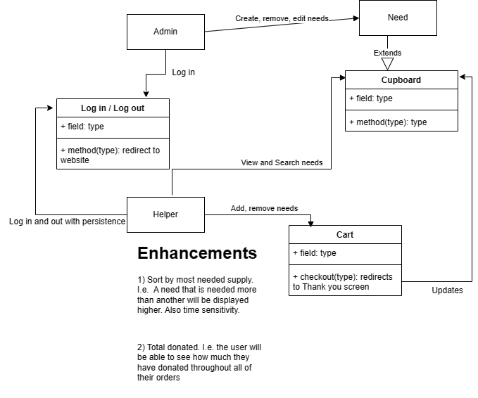

# PROJECT Design Documentation

> _The following template provides the headings for your Design
> Documentation.  As you edit each section make sure you remove these
> commentary 'blockquotes'; the lines that start with a > character
> and appear in the generated PDF in italics but do so only **after** all team members agree that the requirements for that section and current Sprint have been met. **Do not** delete future Sprint expectations._

## Team Information
* Team name: 71g3r (Tiger)
* Team members
  * Christopher Brooks
  * Howard Kong
  * Austin Kunkel
  * Ethan Ricker

## Executive Summary

Our project is U-Fund School Supplies. Many students are in need of school supplies. With this website, you can pick and choose school supplies to donate to schools. Examples include Backpacks, Art Supplies, Lunches, and other common supplies. Each need has an amount that is requested and users can fund to meet that goal.

### Purpose
>  _**[Sprint 2 & 4]** Provide a very brief statement about the project and the most
> important user group and user goals._

Our project is Ufund: School Supplies. Many students are in need of school supplies. With our website, you can pick any supply and fund them for students. It will show you what supplies are needed, the cost, and a description of each one. With our website, you can help students who may not be able to afford these supplies. 

### Glossary and Acronyms
> _**[Sprint 2 & 4]** Provide a table of terms and acronyms._

| Term | Definition |
|------|------------|
| Gift | the item or supply to the funded |
| Helpers | the uesrs who have an account and can purchase items for students |
| Admin | a person who can edit the items in the cupboard |
| Cupboard | where all the items to be funded are stored. Everything in the cupboard is able to be funded by Helpers |

## Requirements

This section describes the features of the application.

Users can log in with their own account.
Users can browse a list of needs (school supplies).
Users can pick a need to support and pick the amount to support.
Users can add items to their cart and checkout
Users have persistence, they can log out and cart will save 
Admins can edit the needs in the cupboard, edit amount, add/remove items, etc.

### Definition of MVP
> _**[Sprint 2 & 4]** Provide a simple description of the Minimum Viable Product._

Users should be able to login and logout, view all of the needs, search for needs, add needs to cart, and logout and have the items in the cart save. Admins should also be able to login and add/remove or edit items.

### MVP Features
>  _**[Sprint 4]** Provide a list of top-level Epics and/or Stories of the MVP._

### Enhancements
> _**[Sprint 4]** Describe what enhancements you have implemented for the project._

## Application Domain

This section describes the application domain.

> _**[Sprint 2 & 4]** Provide a high-level overview of the domain for this application. You
> can discuss the more important domain entities and their relationship
> to each other._

The domain for Ufund School supplies includes the users and the cupboard. Users include both the admin and the helper. Both of these have different tasks. The admin can add, edit, or remove needs, while the helper can add/remove needs to the cart and purchase needs. The cupboard contains the list of needs. Needs themselves have a cost, description, and quantity needed. All the needs in the cupboard are presented to the user. 

## Architecture and Design

This section describes the application architecture.

### Summary

The following Tiers/Layers model shows a high-level view of the webapp's architecture. 

The web application, is built using the Model–View–ViewModel (MVVM) architecture pattern. 

The Model stores the application data objects including any functionality to provide persistance. 

The View is the client-side SPA built with Angular utilizing HTML, CSS and TypeScript. The ViewModel provides RESTful APIs to the client (View) as well as any logic required to manipulate the data objects from the Model.

Both the ViewModel and Model are built using Java and Spring Framework. Details of the components within these tiers are supplied below.

### Overview of User Interface

This section describes the web interface flow; this is how the user views and interacts with the web application.

When you first enter the application, you are brought to the home page. This page shows all the needs that are available to fund. It gives you the option to add to cart, but since you are not logged in yet, clicking on add to cart will bring you to the login page. Here you can login or create an account. Logging in will bring you back into the home page where you can add items to your cart. You can also click on each item to view more details about it, such as cost, a description, etc.. If you are a admin you are brought to a separate page.

### View Tier
> _**[Sprint 4]** Provide a summary of the View Tier UI of your architecture.
> Describe the types of components in the tier and describe their
> responsibilities.  This should be a narrative description, i.e. it has
> a flow or "story line" that the reader can follow._

> _**[Sprint 4]** You must  provide at least **2 sequence diagrams** as is relevant to a particular aspects 
> of the design that you are describing.  (**For example**, in a shopping experience application you might create a 
> sequence diagram of a customer searching for an item and adding to their cart.)
> As these can span multiple tiers, be sure to include an relevant HTTP requests from the client-side to the server-side 
> to help illustrate the end-to-end flow._

> _**[Sprint 4]** To adequately show your system, you will need to present the **class diagrams** where relevant in your design. Some additional tips:_
 >* _Class diagrams only apply to the **ViewModel** and **Model** Tier_
>* _A single class diagram of the entire system will not be effective. You may start with one, but will be need to break it down into smaller sections to account for requirements of each of the Tier static models below._
 >* _Correct labeling of relationships with proper notation for the relationship type, multiplicities, and navigation information will be important._
 >* _Include other details such as attributes and method signatures that you think are needed to support the level of detail in your discussion._

### ViewModel Tier
**GiftController:** Controls and implements the CRUD operations for the Gifts (Needs). Has update, delete, add, get all, retrieve, etc.
**UserController:** COntrols and implements the CRUD operations for the Users. Same as gifts, can add users, delete, edit, etc.

> _**[Sprint 4]** Provide a summary of this tier of your architecture. This
> section will follow the same instructions that are given for the View
> Tier above._

> _At appropriate places as part of this narrative provide **one** or more updated and **properly labeled**
> static models (UML class diagrams) with some details such as critical attributes and methods._
> 

### Model Tier
**Gift:** Represents the gift (Need). It has a name, description, price, and the amount needed for funding.
**User:** A U-Fund user. Has a username, password, email, and their cart. Their data will save in the cart.

> _**[Sprint 2, 3 & 4]** Provide a summary of this tier of your architecture. This
> section will follow the same instructions that are given for the View
> Tier above._

**Sprint 2** 
**Order:** Represents an order. This is a list of OrderItems that a user ordered. It has an ID, date of checkout, and the list of items. These are made per user.

**OrderItem:** This represents and item ordered by user. A list of these are in Order.

**Priority:** This is for a feature enhancement, where we will have a need priority. Just a placeholder for now.

> _At appropriate places as part of this narrative provide **one** or more updated and **properly labeled**
> static models (UML class diagrams) with some details such as critical attributes and methods._
> 

## OO Design Principles

> _**[Sprint 2, 3 & 4]** Will eventually address upto **4 key OO Principles** in your final design. Follow guidance in augmenting those completed in previous Sprints as indicated to you by instructor. Be sure to include any diagrams (or clearly refer to ones elsewhere in your Tier sections above) to support your claims._

Low Coupling: Each class should be as independent as possible. For example, the Gift and User CRUD operations are implemented in separate files to avoid conflict. Although the code actions are mostly the same, it would be best to keep them separated in case we need unique code for one.

Controller: We followed the Controller Model View model for creating our software. For example, GiftController nad UserController are separate, while Gift and Controller classes are in their own files in the model folder. We also have a separate folder for persistence, which deals with persistence.

Law of Demeter: We separated the Gift and User classes, they cannot access each others data.

Dependency Inversion/Injection: We abstracted certain parts of our code. A big example of this is in the DAO files. For example, we have the code that adds a new Gift to the cupboard. The code that actually writes to the JSON itself (And follows the JSON format) is abstracted away for us already. All we have to do it call the DAO function. This is better because we now only have to worry about just calling the add function, and have to know nothing about the implementation of actually writing the JSON.

Open/Closed: We designed our classes to be able to extended easily. We could add more code/functionality to it if we wanted to. But we also kept it closed/avoided modification. This way, we can extend our classes if needed, but not change them completely.

We also worked on separate files as much as possible. This helps us avoid merge conflicts. This made the code easier for the team to work on, since we didn't have to constantly worry about overwriting each others code.

> _**[Sprint 3 & 4]** OO Design Principles should span across **all tiers.**_

## Static Code Analysis/Future Design Improvements
> _**[Sprint 4]** With the results from the Static Code Analysis exercise, 
> **Identify 3-4** areas within your code that have been flagged by the Static Code 
> Analysis Tool (SonarQube) and provide your analysis and recommendations.  
> Include any relevant screenshot(s) with each area._

> _**[Sprint 4]** Discuss **future** refactoring and other design improvements your team would explore if the team had additional time._

## Testing

### Acceptance Testing
> _**[Sprint 2 & 4]** Report on the number of user stories that have passed all their
> acceptance criteria tests, the number that have some acceptance
> criteria tests failing, and the number of user stories that
> have not had any testing yet. Highlight the issues found during
> acceptance testing and if there are any concerns._

**Sprint 2, User stories added during this sprint:**

**Login:** All passed

**Logout**: All passed

**Home page (where needs are listed):** All passed

**Search**: All passed

**Admin page**: All passed. As of 4-21-24 this page is done.

**Cart:** All passed. Fixed error with removing items on 4-21-24.

**Details page:** All passed.

### Unit Testing and Code Coverage
> _**[Sprint 4]** Discuss your unit testing strategy. Report on the code coverage
> achieved from unit testing of the code base. Discuss the team's
> coverage targets, why you selected those values, and how well your
> code coverage met your targets._

>_**[Sprint 2 & 4]** **Include images of your code coverage report.** If there are any anomalies, discuss
> those._

**Sprint 2 Code Coverage Report**

We were able to achieve 90% test coverage for this sprint.

## Ongoing Rationale
>_**[Sprint 1, 2, 3 & 4]** Throughout the project, provide a time stamp **(yyyy/mm/dd): Sprint # and description** of any _**mayor**_ team decisions or design milestones/changes and corresponding justification._

2024-2-09 Sprint 1: Team decided School Supplies U-Fund idea and created sprint 1 plan.

2024-2-20 Sprint 1: Team decided on using Gift for the needs.

2024-3-20 Spring 2: Team decided to store password as a SHA512 hash instead of plaintext for better security.
